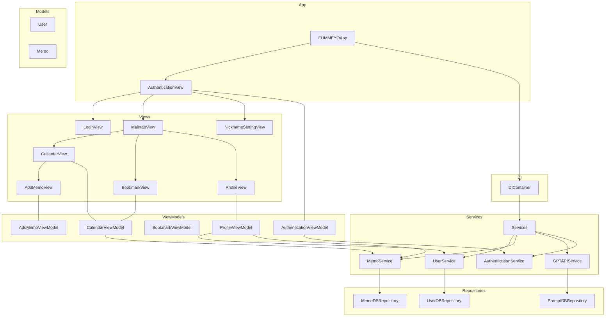

# EUM-MEYO (음메요)

<p align="center">
  
</p>

## 📱 프로젝트 소개

EUMMEYO는 일상의 순간들을 쉽고 간편하게 기록할 수 있는 iOS 다이어리 앱입니다. 
텍스트 메모와 함께 음성 녹음 기능을 제공하여 사용자의 감정과 생각을 더욱 풍부하게 담아낼 수 있습니다.

<br/>

## 🍎 Developers

 |  |  |  |
|:-----:|:-----:|:-----:|:-----:|
| [김은찬](https://github.com/evanKim1999) | [김동현](https://github.com/indextrown) | [장주진](https://github.com/TripleJ709) | [홍예희](https://github.com/HongYehee) |
|팀장 👑|팀원 👨🏻‍💻|팀원 👨🏻‍💻|팀원 👨🏻‍💻|
|`캘린더`, `프로필`|`로그인`, `즐겨찾기`| `캘린더`, `GPT 음메요약` |`기획`, `캐릭터 디자인`|
</div>
<br/>

## ✨ 주요 기능

- **간편한 메모 작성**: 텍스트와 음성으로 일상을 기록
- **캘린더 뷰**: 날짜별 메모 조회 및 관리
- **북마크**: 중요한 메모를 즐겨찾기
- **GPT 요약**: 긴 메모를 자동으로 요약
- **프로필 관리**: 개인화된 사용자 경험

## 🛠 기술 스택

- **Framework**: SwiftUI
- **Architecture**: MVVM + Clean Architecture
- **Database**: Firebase Realtime Database, Firebase Storage
- **Authentication**: Firebase Auth
- **Dependencies**:
  - Firebase
  - OpenAI
  - Combine

## 📦 프로젝트 구조
```bash
EUMMEYO/
├── Model/ # 데이터 모델
├── View/ # UI 컴포넌트
├── Service/ # 비즈니스 로직
├── Repository/ # 데이터 접근 계층
├── General/ # 유틸리티
└── Extension/ # Swift 확장
```

## MVVM + CleanArchitecture


## Getting Started

공개하지 않아야 하는 파일들은 Private 레포지토리에 있으며 이 곳에 초대를 받은 사람이라면 명령어 1줄을 입력하면 자동으로 모든 환경이 세팅됩니다.

```bash
# 참고: 최초 한 번은 토큰 요청이 필요합니다. 요청 시 노션에 제공된 토큰을 입력해주세요.
make download-privates
```

